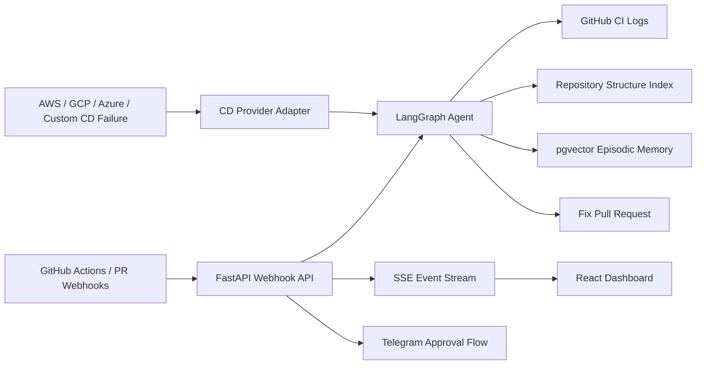

# Autonomous CI/CD Remediation Agent

An AI-powered DevOps agent that monitors GitHub Actions, diagnoses CI failures with repository-aware context, and opens fix pull requests. The system combines a FastAPI backend, LangGraph/LangChain orchestration, PostgreSQL/pgvector memory, provider-neutral CD diagnostics, Telegram approval workflows, and a React dashboard.

## Highlights

- **Autonomous CI fixer:** Receives GitHub `workflow_run` webhooks, fetches failed job logs, builds context from the Repository Structure Index (RSI), generates a patch, and opens a GitHub fix PR.
- **Repository Structure Index:** Parses repo files into PostgreSQL tables for file roles, symbols, imports, sensitivity flags, and repo summaries so the agent can retrieve targeted context instead of sending the whole codebase to the LLM.
- **Episodic memory:** Stores merged fix knowledge in `agent_memory` with OpenAI embeddings, pgvector `vector(1024)`, HNSW indexing, and cosine similarity for few-shot RAG on future failures.
- **PR review workflow:** Reviews pull requests with RSI context, quality thresholds, Telegram approval actions, and optional fix generation for low-scoring changes.
- **Cloud-agnostic CD diagnostics:** Normalizes AWS, GCP, Azure, and custom webhook failures into a shared `CDFailureContext` before LLM diagnosis.
- **Portfolio-ready deployment:** Includes Dockerfiles, Docker Compose with PostgreSQL/pgvector, environment templates, and benchmark tooling for measuring debugging-time reduction.

## Tech Stack

**Backend:** Python 3.13, FastAPI, Uvicorn, LangChain, LangGraph, asyncpg, PostgreSQL, pgvector, OpenAI API, GitHub MCP tools, Telegram Bot API  
**Frontend:** React 19, TypeScript, Vite, Tailwind CSS 4, Server-Sent Events  
**Infrastructure:** Docker, Docker Compose, PostgreSQL/pgvector, GitHub OAuth, GitHub webhooks

- **Autonomous CI fixer:** Receives GitHub `workflow_run` webhooks, fetches failed job logs, builds context from the Repository Structure Index (RSI), generates a patch, and opens a GitHub fix PR.
- **Repository Structure Index:** Parses repo files into PostgreSQL tables for file roles, symbols, imports, sensitivity flags, and repo summaries so the agent can retrieve targeted context instead of sending the whole codebase to the LLM.
- **Episodic memory:** Stores merged fix knowledge in `agent_memory` with OpenAI embeddings, pgvector `vector(1024)`, HNSW indexing, and cosine similarity for few-shot RAG on future failures.
- **PR review workflow:** Reviews pull requests with RSI context, quality thresholds, Telegram approval actions, and optional fix generation for low-scoring changes.
- **Cloud-agnostic CD diagnostics:** Normalizes AWS, GCP, Azure, and custom webhook failures into a shared `CDFailureContext` before LLM diagnosis.
- **Portfolio-ready deployment:** Includes Dockerfiles, Docker Compose with PostgreSQL/pgvector, environment templates, and benchmark tooling for measuring debugging-time reduction.
## Architecture



## Repository Layout

```text
server/
  agent/          LangGraph CI fixer, PR reviewer, prompts, GitHub tools
  rsi/            Repository parsing, indexing, PostgreSQL schema and CRUD
  memory/         OpenAI embedding + pgvector episodic memory store
  cd_providers/   AWS, GCP, Azure, and custom CD failure adapters
  main.py         FastAPI app, webhooks, events, background jobs
client/
  src/            React dashboard, OAuth flow, monitoring screens
benchmarks/
  ci-debugging-time/
                  Benchmark template and calculator for resume metrics
```

## Local Setup

### 1. Configure Environment

```bash
cp server/.env.example server/.env
cp client/.env.example client/.env
```

Fill in at least:

- `OPENAI_API_KEY`
- `GITHUB_CLIENT_ID`
- `GITHUB_CLIENT_SECRET`
- `GITHUB_WEBHOOK_SECRET`
- `DATABASE_URL`
- `TOKEN_ENCRYPTION_KEY`

For local GitHub webhooks, set `WEBHOOK_BASE_URL` to a public HTTPS tunnel URL such as ngrok.

### 2. Run With Docker Compose

```bash
docker compose up --build
```

Services:

- Frontend: `http://localhost:8080`
- API: `http://localhost:8000`
- PostgreSQL/pgvector: `localhost:5432`

### 3. Run Without Docker

Backend:

```bash
cd server
uv sync
uvicorn main:app --reload --port 8000
```

Frontend:

```bash
cd client
npm install
npm run dev
```

## Deploy Online

Use [DEPLOYMENT.md](DEPLOYMENT.md) to publish a shareable link:

- Backend and PostgreSQL/pgvector on Render.
- Frontend on Vercel.
- GitHub OAuth callback pointed at the Render API.
- Frontend `VITE_API_BASE_URL` pointed at the Render API.

If backend hosting is unavailable, set `VITE_DEMO_MODE=true` on Vercel. The frontend becomes a self-contained demo with sample repositories, CI events, RSI ingestion, memory recall, fix PR creation, and PR review output.

## GitHub OAuth And Webhooks

Create a GitHub OAuth App with callback:

```text
http://localhost:8000/api/auth/callback
```

For deployment, set:

```text
API_BASE_URL=https://your-api-domain
FRONTEND_BASE_URL=https://your-frontend-domain
CORS_ORIGINS=https://your-frontend-domain
WEBHOOK_BASE_URL=https://your-api-domain
```

When a repo is initialized from the dashboard, the backend creates a GitHub webhook for:

- `workflow_run`
- `pull_request`
- `push`

## Benchmarking Resume Claims

The project includes a benchmark harness at:

```bash
benchmarks/ci-debugging-time/
```

Use it to measure manual debugging time versus agent-assisted time-to-fix-PR:

```bash
python3 benchmarks/ci-debugging-time/calculate_claim.py benchmarks/ci-debugging-time/results.csv
```

Only claim a percentage after filling `results.csv` with real measurements. Resume-safe wording once measured:

```text
Benchmarked across N representative CI failures, reducing mean time-to-fix-PR by X% versus manual debugging.
```

## Resume Description

```text
Autonomous CI/CD Remediation Agent | Python, FastAPI, LangChain, LangGraph, PostgreSQL (pgvector), Docker, React
Built an autonomous LangGraph agent powered by OpenAI models that detects GitHub Actions failures through webhooks, retrieves CI logs, uses a Repository Structure Index for targeted context, and opens fix PRs with safety checks and Telegram approval flows.
Implemented episodic memory with OpenAI embeddings, pgvector HNSW cosine search, and few-shot RAG to reuse prior successful fixes; added provider-neutral CD diagnostics across AWS, GCP, Azure, and custom webhook sources.
```

## Production Notes

- Do not commit `.env` files, tokens, ngrok URLs, OAuth secrets, Telegram tokens, or cloud credentials.
- Use a managed PostgreSQL database with pgvector enabled for deployment.
- Configure HTTPS before enabling `APP_ENV=production`, because production cookies are marked secure.
- The benchmark percentage is intentionally not hardcoded in the README; it should come from measured runs.
